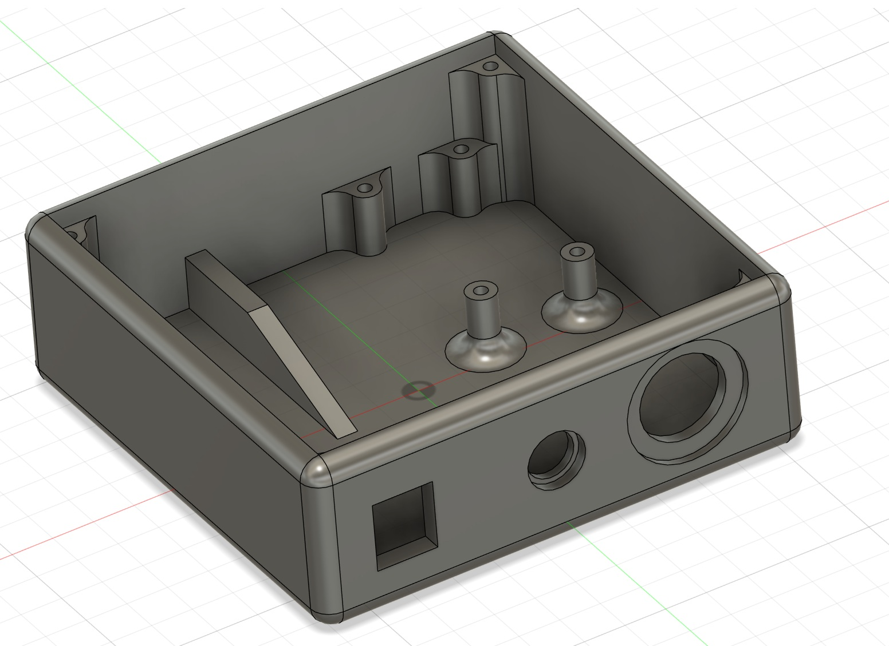
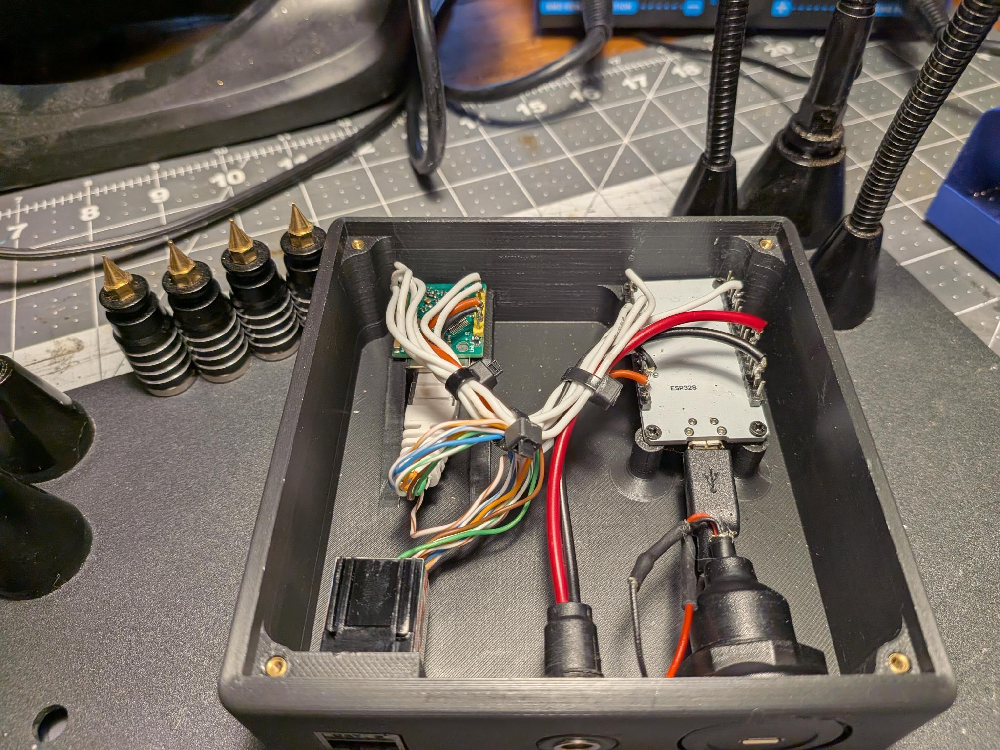
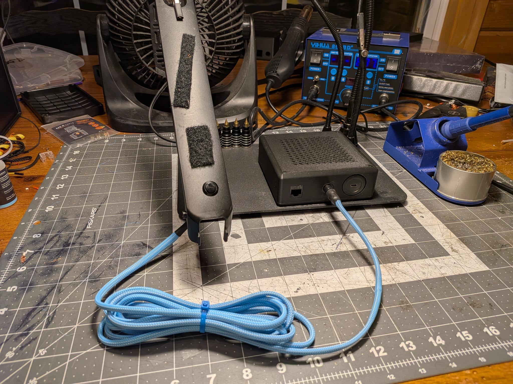
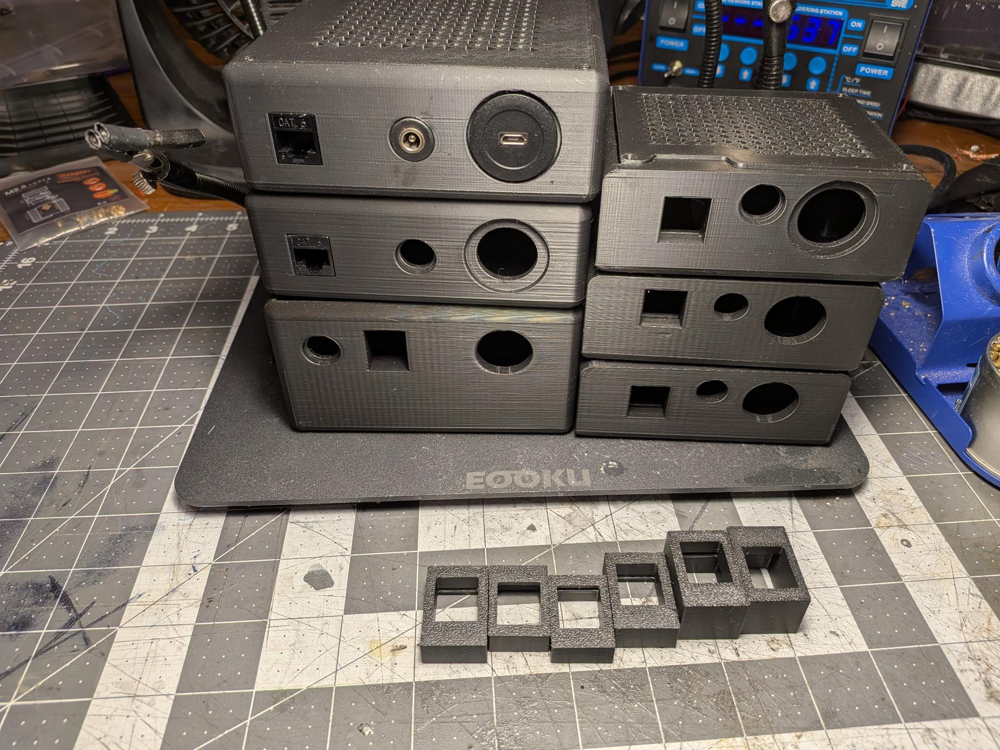

# ESP32 + W5500 Wake-on-LAN Button

A small hardware button that sends a Wake-on-LAN packet to a specific computer, letting it be powered on remotely over Ethernet.

No WiFi. No app. No cloud. Just a button and a wire.

> **Skill level:** This is not a plug-and-play kit. You should be comfortable with basic soldering, cutting and shortening cables.

---

## Why this exists

I built this for my mom.

She has some mobility and back issues and usually uses her laptop from the couch.  
She is a self-professed "spiller", so the laptop was moved to a safer, remote spot to keep it out of harm’s way.

While that did keep her laptop safe, it made the power button hard to reach.  
This little box is the result: a simple external button that lets her turn the computer on without having to lean and risk a fall.

---

## How it works

The box is built around an ESP32 and a W5500 Ethernet module.

On first setup, you hold the button while powering it on.  
In that mode, the device listens for raw Ethernet traffic and learns the MAC address of the target computer automatically.

After that, pressing the button sends a Wake-on-LAN (WOL) packet to the learned network interface, causing the computer to power on.

No WiFi, phone app, or cloud service is involved — it’s just a button and an Ethernet cable.

---

## Design notes

- The W5500 is powered from the ESP32’s 3.3V rail.  
  Early on, the Ethernet side was a bit flaky and would occasionally not come up cleanly.

- So I turned off the ESP32’s WiFi and Bluetooth radios at boot.  
  This box only uses wired Ethernet, so there’s no point burning power on radios that aren’t being used.

- After turning the radios off, the W5500 stopped being flaky.  
  I can’t say for sure this is what fixed it, but the problems went away after that change and it’s been solid since.

---

## Hardware

- ESP32 Dev Module  
- W5500 Ethernet Module (SPI)  
- Momentary push button  
- 3D printed or off-the-shelf enclosure (see `/mechanical`)  

---

## Bill of Materials

### Core electronics
- ESP32 Dev Module — https://www.amazon.com/dp/B08D5ZD528  
- W5500 Ethernet Module — https://www.amazon.com/dp/B08KXM8TKJ  

### User I/O
- Momentary push button — https://www.amazon.com/dp/B0CLG7Z5JS  

### Connectors / pass-through
- USB bulkhead — https://www.amazon.com/dp/B0D17N33TX  
- Button bulkhead — https://www.amazon.com/dp/B0D9B7WR23  
- RJ45 keystone — https://www.amazon.com/dp/B09W8RST25  

### Mechanical
- Screws — https://www.amazon.com/dp/B0D2R68YBC  
- Heat-set inserts — https://www.amazon.com/dp/B0CS6YVJYD  

### Cables
- Ethernet cable — https://www.amazon.com/dp/B0B57RDX6P  
- USB cable — https://www.amazon.com/dp/B07232M876  

> Note: The USB and Ethernet cables were cut and shortened during assembly.

### Tools
- Punchdown tool — https://www.amazon.com/dp/B0072K1QHM  

---

## Enclosure

Here is the custom design for this project as shown in Fusion. The .stl file is in `/mechanical`:

- `enclosure.stl`

---

## Wiring

| Signal | ESP32 GPIO | W5500 |
|--------|------------|--------|
| MOSI   | 23         | MOSI   |
| MISO   | 19         | MISO   |
| SCK    | 18         | SCK    |
| CS     | 5          | CS     |
| RST    | 4          | RST    |
| 3V3    | 3V3        | VCC    |
| GND    | GND        | GND    |
| Button | 27         | → GND  |

---

## Setup

1. Wire the ESP32, W5500, and button.
2. Flash the firmware.
3. Hold the button while powering on to enter learn mode.
4. Generate traffic on the target PC so the device can learn its MAC.
5. It saves the MAC and reboots.
6. Press the button to wake the PC.

---

## Firmware

Located in `/src/wol_button.ino`.

---

## Build & Debug

### Inside the enclosure

### Button mounted
Slightly off-center to allow for everything she velcros to her monitor arm (remotes, etc.). Her computer is her mission control.

The button’s cable is sleeved because I couldn’t sleep at night if the wiring didn’t look decent.  
I just used what I had on hand from my PC’s wiring loom, which happened to be color coded, so don’t judge the sleeve color.

### The numerous iterations
I wanted the keystone to snap in **TIGHT**.

It took a few design iterations to get that right, you can see them as wel as the multiple box designs in the photo below.  
If you print this yourself, expect the keystone fit to be tight so it may take some finesse. In my opinion it’s worth the extra effort for a solid, wobble-free fit.

### Verifying Wake-on-LAN traffic on Wireshark

---

## License

MIT — do whatever you want with it.

